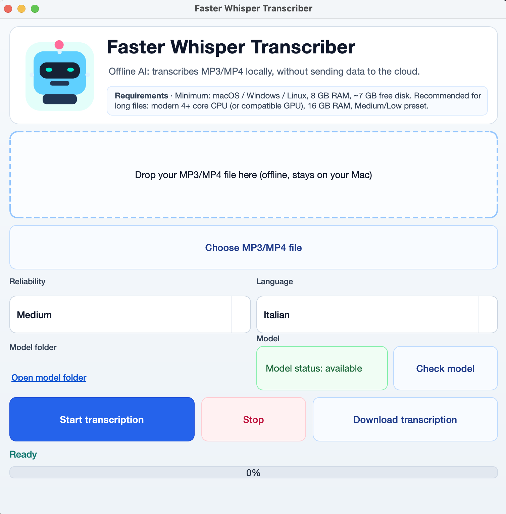

# Faster Whisper Transcriber

Offline transcription for `.mp3` and `.mp4` files using [faster-whisper](https://github.com/SYSTRAN/faster-whisper), available in two modes:
- Desktop GUI: `transcription_gui.py`
- CLI: `transcription_cli.py`

The project is designed for local usage: files stay on your device and output is saved as `.txt`.

## App Screenshot



## Key Features

- Local transcription (offline after model download)
- `.mp3` and `.mp4` input support
- 3 GUI presets:
  - `High` -> `large-v3` + `accurate`
  - `Medium` -> `small` + `balanced`
  - `Low` -> `base` + `fast`
- Model check/download directly from the GUI
- Progress bar and stop transcription action
- Text export via `Download transcription`
- Scriptable CLI for automation

## Requirements

- Python `3.10+`
- Python dependencies:

```bash
python3 -m pip install faster-whisper numpy PySide6
```

To build the macOS app:

```bash
python3 -m pip install pyinstaller
```

## Quick Start

```bash
git clone <REPO_URL>
cd faster-whisper-transcriber-ai
python3 -m venv .venv
. .venv/bin/activate
python3 -m pip install --upgrade pip
python3 -m pip install faster-whisper numpy PySide6
python3 transcription_gui.py
```

## GUI Usage (recommended)

Launch:

```bash
python3 transcription_gui.py
```

Recommended flow:

1. Select or drag-and-drop an `.mp3/.mp4` file.
2. Choose preset (`High`, `Medium`, `Low`) and language (`Italian`, `English`).
3. Click `Check model` if the model is missing.
4. Click `Start transcription`.
5. When complete, save the file with `Download transcription`.

Useful notes:

- The GUI starts transcription only if the required model is available in cache.
- If running from a macOS bundle, bundled models are checked first.
- If the GUI crashes at startup, check the log:
  - `~/Library/Logs/faster_whisper_transcriber/startup.log`

## CLI Usage

If there is only one supported file in the current folder (`.mp3/.mp4`):

```bash
python3 transcription_cli.py
```

Examples:

```bash
# Fast
python3 transcription_cli.py --input audio.mp3 --model base --mode fast --lang it

# Balanced
python3 transcription_cli.py --input audio.mp3 --model small --mode balanced --lang it

# Highest accuracy
python3 transcription_cli.py --input audio.mp3 --model large-v3 --mode accurate --lang it

# Use already-downloaded models only (strict offline mode)
python3 transcription_cli.py --input audio.mp3 --local-files-only

# Also print output to stdout
python3 transcription_cli.py --input audio.mp3 --stdout
```

Main parameters:

- `--input`: `.mp3/.mp4` input file
- `--output`: `.txt` output file (default: same name as input)
- `--lang`: language (`it`, `en`, ...)
- `--prompt`: optional contextual prompt
- `--model`: `tiny|base|small|medium|large-v3`
- `--mode`: `fast|balanced|accurate`
- `--model-cache-dir`: model cache directory
- `--local-files-only`: do not download models
- `--stdout`: print transcription to terminal

## Model Cache

Used paths:

- GUI (user):
  - `~/Library/Application Support/faster_whisper_transcriber/models/faster-whisper`
- CLI (default):
  - `./models/faster-whisper`

## Build macOS App (.app)

Recommended spec: `faster_whisper_transcriber.spec`.

```bash
PYINSTALLER_CONFIG_DIR=.pyinstaller python3 -m PyInstaller -y faster_whisper_transcriber.spec
```

Main outputs:

- `dist/Faster Whisper Transcriber.app`
- `dist/FasterWhisperTranscriber/`

To include models in the bundle (optional, for offline distribution):

```bash
mkdir -p "dist/Faster Whisper Transcriber.app/Contents/Frameworks/models"
cp -R "models/faster-whisper" "dist/Faster Whisper Transcriber.app/Contents/Frameworks/models/faster-whisper"
rm -rf "dist/Faster Whisper Transcriber.app/Contents/Frameworks/models/faster-whisper/.locks"
codesign --force --deep --sign - "dist/Faster Whisper Transcriber.app"
```

macOS distribution notes:

- On first launch, Gatekeeper may block the app: right-click -> `Open`.
- For public distribution, consider Apple signing and notarization.

## Project Structure

- `transcription_gui.py`: PySide6 desktop app
- `transcription_cli.py`: CLI transcription tool
- `faster_whisper_transcriber.spec`: PyInstaller build spec (icon + app bundle)
- `resources/`: icons and assets

## License

Apache License 2.0. See [LICENSE](LICENSE).
